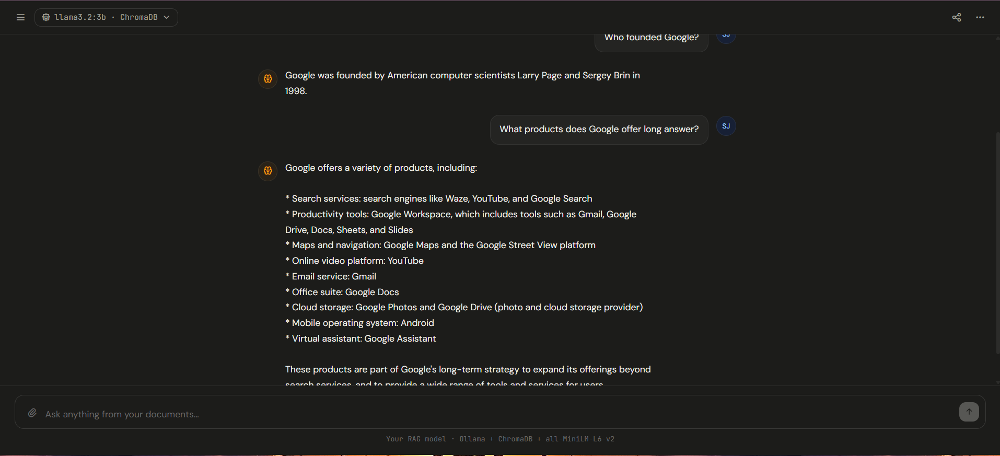

<div align="center">

# 🧠 Local RAG Chatbot

**A fully local Retrieval-Augmented Generation chatbot — no cloud APIs, no data leaks.**

[](https://python.org)
[](https://fastapi.tiangolo.com)
[](https://langchain.com)
[](https://ollama.com)
[](https://www.trychroma.com)
[](LICENSE)
[]()

<br/>

> Upload your documents → Ask questions → Get AI-powered answers — **entirely on your machine.**

<br/>



</div>

---

## 📑 Table of Contents

- [Overview](#-overview)
- [Architecture](#-architecture)
- [Tech Stack](#-tech-stack)
- [Features](#-features)
- [Project Structure](#-project-structure)
- [Getting Started](#-getting-started)
  - [Prerequisites](#prerequisites)
  - [Installation](#installation)
  - [Ollama Setup](#ollama-setup)
- [Running the Project](#-running-the-project)
  - [1. Document Ingestion](#1-document-ingestion)
  - [2. FastAPI Backend](#2-fastapi-backend)
  - [3. Frontend](#3-frontend)
- [API Documentation](#-api-documentation)
- [Example Requests & Responses](#-example-requests--responses)
- [Troubleshooting](#-troubleshooting)
- [Future Improvements](#-future-improvements)
- [Contributing](#-contributing)
- [License](#-license)

---

## 🔍 Overview

**Local RAG Chatbot** is an end-to-end Retrieval-Augmented Generation (RAG) system that runs completely on your local machine. It allows you to upload PDF or text documents, processes them into a ChromaDB vector store, and answers natural-language questions by retrieving the most relevant context and passing it to a locally running **Llama 3.2** model via Ollama.

No OpenAI key. No cloud. No data ever leaves your system.

---

## 🏗 Architecture

```
┌─────────────────────────────────────────────────────────────┐
│                        USER INTERFACE                        │
│              index.html + style.css + app.js                │
└──────────────────────────┬──────────────────────────────────┘
                           │  HTTP POST /query
                           ▼
┌─────────────────────────────────────────────────────────────┐
│                     FASTAPI BACKEND                         │
│                       rag_api.py                            │
└────────────┬──────────────────────────┬─────────────────────┘
             │                          │
             ▼                          ▼
┌────────────────────┐      ┌───────────────────────┐
│  RETRIEVAL ENGINE  │      │   INGESTION PIPELINE   │
│ retrieval_pipeline │      │  ingestion_pipeline.py │
│       .py          │      │                        │
│                    │      │  • Load documents       │
│  • Embed query     │      │  • Chunk text           │
│  • Search ChromaDB │      │  • Generate embeddings  │
│  • Return top-k    │      │  • Store in ChromaDB    │
└────────┬───────────┘      └──────────┬─────────────┘
         │                             │
         ▼                             ▼
┌─────────────────────────────────────────────────────────────┐
│                        CHROMADB                              │
│              Persistent Local Vector Store                   │
│         Embeddings: nomic-embed-text (via Ollama)            │
└──────────────────────────┬──────────────────────────────────┘
                           │  Top-K Chunks
                           ▼
┌─────────────────────────────────────────────────────────────┐
│                     RAG PIPELINE                             │
│                    rag_pipeline.py                           │
│                                                             │
│   Retrieved Context + User Query → Prompt Template          │
│            ↓                                                │
│        Ollama (Llama 3.2) → Final Answer                    │
└─────────────────────────────────────────────────────────────┘
```

**Data Flow:**

```
docs/ folder
    │
    ▼
[Load PDFs/TXTs]  →  [Chunk Text]  →  [nomic-embed-text]  →  [ChromaDB]
                                                                   │
User Query ──── [nomic-embed-text] ──── [Cosine Similarity Search]─┘
                                                   │
                                             Top-K Chunks
                                                   │
                                    [Llama 3.2 via Ollama]
                                                   │
                                             Final Answer
```

---

## 🛠 Tech Stack

| Layer | Technology | Purpose |
|-------|-----------|---------|
| **LLM** | Llama 3.2 (via Ollama) | Local answer generation |
| **Embeddings** | nomic-embed-text (via Ollama) | Document & query vectorization |
| **Vector Store** | ChromaDB | Persistent semantic search |
| **RAG Framework** | LangChain | Chunking, retrieval, prompt chaining |
| **Backend** | FastAPI | REST API server |
| **Frontend** | HTML + CSS + JavaScript | Chat interface |
| **Language** | Python 3.10+ | Backend runtime |

---

## ✨ Features

- 🔒 **Fully Local** — All models run via Ollama; zero data sent to any external service
- 📄 **Document Ingestion Pipeline** — Automatically loads, chunks, and indexes your documents
- ✂️ **Smart Chunking** — LangChain's `RecursiveCharacterTextSplitter` for optimal chunk size
- 🧬 **Embedding Generation** — `nomic-embed-text` for high-quality semantic embeddings
- 🗄 **Persistent Vector Store** — ChromaDB stores embeddings on disk across sessions
- 🔎 **Semantic Search** — Cosine similarity retrieval for relevant context
- 🤖 **Llama 3.2 Generation** — Local LLM generates grounded, context-aware answers
- ⚡ **FastAPI Backend** — Async REST API with automatic Swagger docs
- 🖥 **Custom Chat UI** — Clean, responsive frontend with source attribution
- 💬 **End-to-End Chat** — From document upload to conversational Q&A in one pipeline

---

## 📁 Project Structure

```
local-rag-chatbot/
│
├── backend/
│   ├── ingestion_pipeline.py   # Load docs → chunk → embed → store in ChromaDB
│   ├── retrieval_pipeline.py   # Query → embed → search ChromaDB → return chunks
│   ├── rag_pipeline.py         # Combine retrieved chunks + LLM → final answer
│   └── rag_api.py              # FastAPI app with /query endpoint
│
├── frontend/
│   ├── index.html              # Chat UI markup
│   ├── style.css               # Styling
│   └── app.js                  # API calls, message rendering, UI logic
│
├── chroma_db/                  # Auto-generated: persistent ChromaDB storage
│
├── docs/                       # Place your PDF/TXT documents here
│
├── requirements.txt
└── README.md
```

---

## 🚀 Getting Started

### Prerequisites

Make sure you have the following installed:

- **Python 3.10+** — [Download](https://python.org/downloads)
- **Ollama** — [Download](https://ollama.com/download)
- A modern web browser (Chrome, Firefox, Edge)

---

### Installation

**1. Clone the repository**

```bash
git clone https://github.com/DevByShree/local-rag-chatbot.git
cd local-rag-chatbot
```

**2. Create and activate a virtual environment**

```bash
# Windows
python -m venv venv
venv\Scripts\activate

# macOS / Linux
python -m venv venv
source venv/bin/activate
```

**3. Install Python dependencies**

```bash
pip install -r requirements.txt
```

<details>
<summary><strong>requirements.txt (reference)</strong></summary>

```txt
fastapi
uvicorn[standard]
langchain
langchain-community
langchain-ollama
chromadb
pymupdf
python-multipart
```

</details>

---

### Ollama Setup

**1. Install Ollama**

Visit [https://ollama.com/download](https://ollama.com/download) and install for your OS.

**2. Verify Ollama is running**

```bash
ollama --version
```

**3. Pull the required models**

```bash
# LLM for answer generation
ollama pull llama3.2

# Embedding model for vectorization
ollama pull nomic-embed-text
```

**4. Verify models are available**

```bash
ollama list
```

Expected output:
```
NAME                    ID              SIZE    MODIFIED
llama3.2:latest         ...             2.0 GB  ...
nomic-embed-text:latest ...             274 MB  ...
```

> ⚠️ **Note:** Keep Ollama running in the background before starting the backend. It serves on `http://localhost:11434` by default.

---

## ▶️ Running the Project

### 1. Document Ingestion

Place your PDF or TXT documents inside the `docs/` folder, then run:

```bash
python backend/ingestion_pipeline.py
```

**What it does:**
- Loads all documents from `docs/`
- Splits them into chunks (default: 500 tokens, 50 overlap)
- Generates embeddings using `nomic-embed-text`
- Stores vectors in ChromaDB at `chroma_db/`

Expected output:
```
[INFO] Loading documents from docs/...
[INFO] Loaded 3 document(s)
[INFO] Splitting into chunks...
[INFO] Generated 142 chunks
[INFO] Generating embeddings and storing in ChromaDB...
[INFO] ✅ Ingestion complete. 142 chunks stored.
```

> 💡 Re-run ingestion whenever you add new documents to `docs/`.

---

### 2. FastAPI Backend

```bash
uvicorn backend.rag_api:app --reload --port 8000
```

The API will be live at: `http://localhost:8000`

Interactive Swagger docs: `http://localhost:8000/docs`

---

### 3. Frontend

Simply open the frontend in your browser:

```bash
# Option A — open directly
open frontend/index.html

# Option B — serve with Python (recommended to avoid CORS issues)
python -m http.server 5500 --directory frontend
# Then visit: http://localhost:5500
```

> ✅ Make sure the FastAPI server is running before opening the frontend.

---

## 📖 API Documentation

### Base URL

```
http://localhost:8000
```

### Endpoints

#### `POST /query`

Submit a question to the RAG pipeline.

**Request Body**

```json
{
  "query": "string",
  "top_k": 4
}
```

| Field | Type | Required | Default | Description |
|-------|------|----------|---------|-------------|
| `query` | string | ✅ | — | The user's question |
| `top_k` | integer | ❌ | `4` | Number of chunks to retrieve |

**Response**

```json
{
  "answer": "string",
  "sources": ["string"],
  "chunks_used": 4
}
```

| Field | Type | Description |
|-------|------|-------------|
| `answer` | string | LLM-generated answer |
| `sources` | array | Source document filenames |
| `chunks_used` | integer | Number of retrieved chunks used |

---

#### `GET /health`

Check if the API is running.

**Response**

```json
{
  "status": "ok",
  "model": "llama3.2",
  "embedding_model": "nomic-embed-text"
}
```

---

#### `GET /docs`

Auto-generated Swagger UI (built into FastAPI).

---

## 💡 Example Requests & Responses

### cURL

```bash
curl -X POST http://localhost:8000/query \
  -H "Content-Type: application/json" \
  -d '{"query": "What is RAG architecture?", "top_k": 4}'
```

### Python

```python
import requests

response = requests.post(
    "http://localhost:8000/query",
    json={"query": "Summarize the key points from my documents", "top_k": 5}
)
print(response.json())
```

### JavaScript (Fetch)

```javascript
const res = await fetch("http://localhost:8000/query", {
  method: "POST",
  headers: { "Content-Type": "application/json" },
  body: JSON.stringify({ query: "What topics are covered?", top_k: 4 })
});
const data = await res.json();
console.log(data.answer);
```

---

### Sample Response

```json
{
  "answer": "RAG (Retrieval-Augmented Generation) is a technique that combines semantic search with LLM generation. It first retrieves the most relevant document chunks from a vector database using embedding similarity, then passes those chunks as context to the language model to generate a grounded, accurate answer.",
  "sources": [
    "rag_notes.pdf",
    "langchain_docs.pdf"
  ],
  "chunks_used": 4
}
```

---

## 🐛 Troubleshooting

<details>
<summary><strong>❌ Ollama connection refused</strong></summary>

**Error:** `Connection refused at http://localhost:11434`

**Fix:** Ollama is not running. Start it:
```bash
ollama serve
```
</details>

<details>
<summary><strong>❌ Model not found</strong></summary>

**Error:** `model 'llama3.2' not found`

**Fix:** Pull the model first:
```bash
ollama pull llama3.2
ollama pull nomic-embed-text
```
</details>

<details>
<summary><strong>❌ ChromaDB empty / no results</strong></summary>

**Error:** Returns empty answers or "I don't know"

**Fix:** You haven't run the ingestion pipeline yet, or `docs/` is empty.
```bash
# Add documents to docs/, then:
python backend/ingestion_pipeline.py
```
</details>

<details>
<summary><strong>❌ CORS error in browser</strong></summary>

**Error:** `CORS policy: No 'Access-Control-Allow-Origin'`

**Fix:** Add CORS middleware to `rag_api.py`:
```python
from fastapi.middleware.cors import CORSMiddleware

app.add_middleware(
    CORSMiddleware,
    allow_origins=["*"],
    allow_methods=["*"],
    allow_headers=["*"],
)
```
</details>

<details>
<summary><strong>❌ Slow responses</strong></summary>

Llama 3.2 runs on CPU by default if you don't have a compatible GPU. This is expected.

**Fix options:**
- Use a smaller model: `ollama pull llama3.2:1b`
- Enable GPU acceleration (NVIDIA GPU required): Ollama auto-detects CUDA if drivers are installed
</details>

---

## 🔮 Future Improvements

- [ ] **Multi-format support** — DOCX, CSV, Markdown ingestion
- [ ] **Chat history** — Multi-turn conversation memory with LangChain `ConversationBufferMemory`
- [ ] **Re-ranking** — Cross-encoder re-ranking of retrieved chunks for better precision
- [ ] **Streaming responses** — Server-Sent Events (SSE) for token-by-token streaming
- [ ] **Document management UI** — Upload, view, and delete documents from the frontend
- [ ] **Model switcher** — Select between multiple Ollama models from the UI
- [ ] **Confidence scores** — Show similarity scores alongside source citations
- [ ] **Docker support** — `docker-compose` for one-command setup
- [ ] **Authentication** — Basic auth or JWT for API protection
- [ ] **Eval pipeline** — RAGAS-based evaluation for retrieval and generation quality

---

## 🤝 Contributing

Contributions are welcome! Here's how:

1. Fork the repository
2. Create a feature branch: `git checkout -b feature/your-feature`
3. Commit your changes: `git commit -m "feat: add your feature"`
4. Push to the branch: `git push origin feature/your-feature`
5. Open a Pull Request

Please follow [Conventional Commits](https://www.conventionalcommits.org/) for commit messages.

---

## 👨‍💻 Author

**Shree Joshi**
- GitHub: [@DevByShree](https://github.com/DevByShree)
- Email: shreejoshi1805@gmail.com

---

## 📄 License

This project is licensed under the **MIT License** — see the [LICENSE](LICENSE) file for details.

---

<div align="center">

⭐ **If this project helped you, please give it a star!** ⭐

*Built with ❤️ using LangChain, Ollama, and ChromaDB*

</div>
